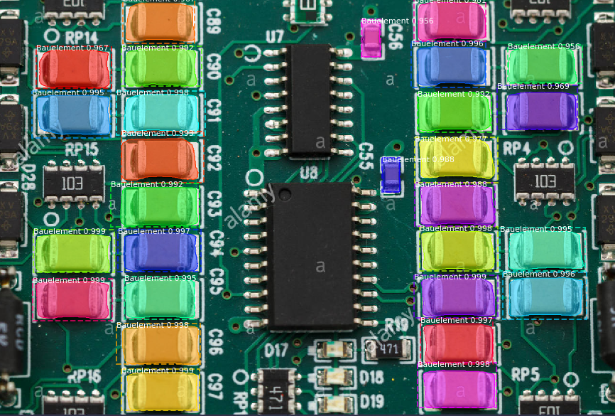

# MaskRCNN
Implementation of [Mask R-CNN](https://arxiv.org/abs/1703.06870) on Python 3,  Keras, and TensorFlow. for detecting Bauelemente



The repository includes:
* Source code of Mask R-CNN built on FPN and ResNet101.
* Training code for MS COCO
* Pre-trained weights for MS COCO
* Pre-trained weight for Bauelemente
* Jupyter notebooks to visualize the detection pipeline at every step
* ParallelModel class for multi-GPU training
* Evaluation on MS COCO metrics (AP)
* Example of training on your own dataset
* Datasets for Bauelements and Example of JSON data (using [VGG Image Annotator](https://gitlab.com/vgg/via/tags/via-1.0.6)), needs to train dataset

# Contributing

Contributions to this repository are welcome. Examples of things you can contribute:

- Speed Improvements. Like re-writing some Python code in TensorFlow or Cython.
- Training on other datasets.
- Accuracy Improvements.
- Visualizations and examples.


### MS COCO Requirements:
To train or test on MS COCO, you'll also need:
* pycocotools (installation instructions below)
* [MS COCO Dataset](http://cocodataset.org/#home)
* Download the 5K [minival](https://dl.dropboxusercontent.com/s/o43o90bna78omob/instances_minival2014.json.zip?dl=0)
  and the 35K [validation-minus-minival](https://dl.dropboxusercontent.com/s/s3tw5zcg7395368/instances_valminusminival2014.json.zip?dl=0)
  subsets. More details in the original [Faster R-CNN implementation](https://github.com/rbgirshick/py-faster-rcnn/blob/master/data/README.md).

If you use Docker, the code has been verified to work on
[this Docker container](https://hub.docker.com/r/waleedka/modern-deep-learning/).


## Installation

1- Install dependencies

    pip3 install -r requirements.txt

2- Clone this repository

3- Run setup from the repository root directory

    python3 setup.py install

4- Download pre-trained COCO and Bauelement weights (logs.zip) from the releases page.

5- (Optional) To train or test on MS COCO install pycocotools from one of these repos. They are forks of the original pycocotools with fixes for Python3 and Windows (the official repo doesn't seem to be active anymore).
- Linux: https://github.com/waleedka/coco
- Windows: https://github.com/philferriere/cocoapi. You must have the Visual C++ 2015 build tools on your path (see the repo for additional details)

# Getting Started
* [demo.ipynb](samples/BauelementSegmentation/demo.ipynb) Is the easiest way to start. It shows an example of using a model pre-trained on MS COCO to segment objects in your own images.
It includes code to run object detection and instance segmentation on arbitrary images.

* [inspect_data.ipynb](samples/BauelementSegmentation/coco/inspect_bauelement_data.ipynb). This notebook visualizes the different pre-processing steps
to prepare the training data.

# Training on MS COCO
We're providing pre-trained weights for MS COCO to make it easier to start. You can
use those weights as a starting point to train your own variation on the network.
Usage: import the module (see Jupyter notebooks for examples), or run from the command line as such:

    # Train a new model starting from pre-trained COCO weights
    python3 coco.py train --dataset=/path/to/bauelement/dataset --weights=coco
    
    # For example: 
    python3 Bauelement.py train --dataset=/home/parchami/PycharmProjects/MaskRCNN/datasets/BauelementDataset
    --weights=coco
    
    # For Multiclass Training:
    python3 MultiBauelement.py train --dataset=/home/parchami/PycharmProjects/Mask_RCNN/datasets/WRelement
    --weights=coco
    
    # Resume training a model that you had trained earlier
    python3 Bauelement.py train --dataset=/path/to/bauelement/dataset --weights=last

    # Train a new model starting from ImageNet weights
    python3 Bauelement.py train --dataset=/path/to/bauelement/dataset --weights=imagenet

# Training on Your Own Dataset

In summary, to train the model on your own dataset you'll need to extend two classes:

```Config```
This class contains the default configuration. Subclass it and modify the attributes you need to change.

```Dataset```
This class provides a consistent way to work with any dataset. 
It allows you to use new datasets for training without having to change 
the code of the model. It also supports loading multiple datasets at the
same time, which is useful if the objects you want to detect are not 
all available in one dataset. 

See examples in `samples/coco/coco.py`, `samples/BauelementSegmentation/Bauelement.py`, `samples/BauelementSegmentation/MultiBauelement.py`.

# Training on Multiclass Dataset

To train in Multiclass mode useing `MultiBauelement.py`.
You should only add some classes using add.class() method and adding class_id's to JSON attribute field and train new weights.


